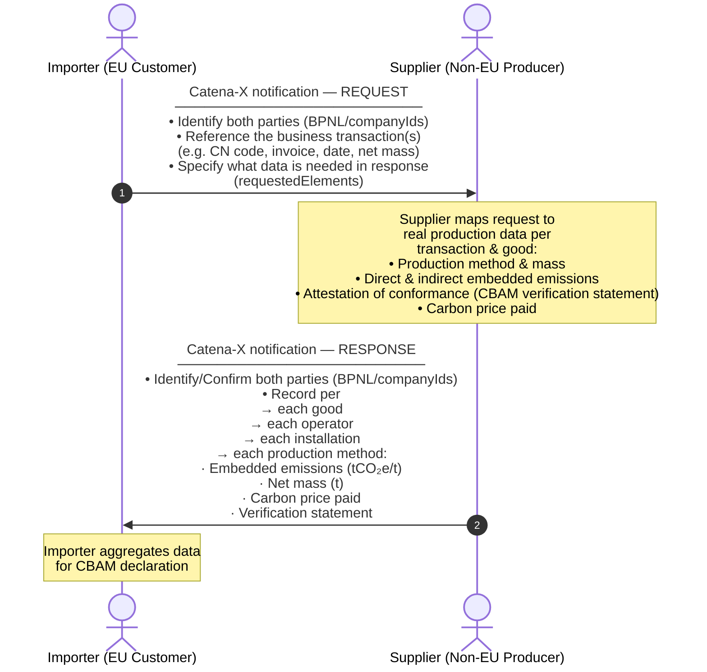

import Kit3DLogo from '@site/src/components/2.0/Kit3DLogo';

<Kit3DLogo kitId="cbam" />

# Introduction

The EU's Carbon Border Adjustment Mechanism (CBAM) sets a fair carbon price on imports of carbon-intensive goods to prevent carbon leakage, meaning the risk that companies relocate production to countries with weaker climate policies, or that EU products are displaced by more emission-intensive imports. CBAM ensures that the carbon cost of imports reflects the same standards applied to domestic EU production.

CBAM applies to the sectors with the highest carbon leakage risk: **cement, iron and steel, aluminum, fertilizers, electricity, and hydrogen**. When fully implemented, it will cover more than 50% of emissions in the sectors subject to the EU Emissions Trading System (ETS). The definitive regime has been in force since 2026, following a transitional phase that ran from October 2023 to the end of 2025. Further development of the regulation is expected, requiring an update of this KIT. 

**Official Links:** 

[Carbon Border Adjustment Mechanism](https://taxation-customs.ec.europa.eu/carbon-border-adjustment-mechanism_en)

[CBAM Guidance and Legislation - Taxation and Customs Union](<https://taxation-customs.ec.europa.eu/carbon-border-adjustment-mechanism/cbam-guidance-and-legislation_en>)

## Mission and Vision

The Eclipse Tractus-X CBAM KIT provides a standardized, interoperable data infrastructure for exchanging CBAM-relevant embedded emissions data across global supply chains. It enables companies to:

- Collect validated CBAM emissions data at the material and component level using harmonized methodologies.
- Automate CBAM data request workflows across fragmented system landscapes, reducing redundancies and administrative burden whilst ensuring compliance with CBAM regulations.
- Integrate upstream and downstream data from suppliers and partners, enabling accurate transmission of embedded emissions data for imported goods.
- Ensure data sovereignty and security, allowing companies to retain control over sensitive sustainability information while meeting transparency requirements.
~~ - Facilitate recognition of foreign carbon pricing schemes, promoting fair treatment of non-EU producers.~~ //Moritz: i don't see a direct connex from Catena to recognition.

## How CBAM Works in Practice

CBAM obligations are triggered when goods are imported into the EU under a CN Code subject to CBAM reporting and originating from specified non-EU countries. Only importers whose annual import volumes exceed a defined mass-based threshold are required to submit declarations to the official EU CBAM portal (currently supporting XML uploads or manual entry). Each declaration must include details on:

- Production installation and date
- Energy sources used
- Verified CO₂ emissions

To collect the required supplier-specific data, the importer sends a structured data request to the supplier via Catena-X. The supplier responds with tailored emission reports covering the relevant installations and production methods (see Figure 1).

Figure 1: The CBAM Data Exchange mechanism with Catena-X

## CBAM Personas

 
  
CBAM Personas | click to expand

Here is a tabular overview of the key roles in the CBAM process:

| Role | Description |
| --- | --- |
|Importer/Declarant| Is responsible for requesting CBAM relevant reporting data, purchasing CO₂ certificates, and submitting reports to the EU|
|Supplier| Business (contractual) partner of the customer/Importer responsible to provide initial product and site information from the operator to the customer.|
|Operator| Is a company who operates one or multiple installations (production sites). Responsible for providing verified CO₂ emission data.|
|EU| The European Commission, specifically the Directorate-General for Taxation and Customs Union (DG TAXUD), is responsible for the design, development, and maintenance of the CBAM Portal and its associated systems. The CBAM Registry, which is the central platform for managing declarant authorizations, submitting emissions reports (planned) and for facilitating communication between importers, national authorities, and the Commission.|

---
 

# Business Process of CBAM Data Exchange in Catena-X 

## CBAM Data Exchange Flow 

This diagram shows the high-level flow of a CBAM data exchange between an **importer** (i.e. customer, typically EU-based) and a **supplier** (i.e. non-EU producer or distributer) using the Catena-X **notification Standard**. Each exchange entails records for one or multiple CBAM goods tied to specific business transactions. This results in a tailored emissions response scoped exactly to the specified transactions, making each exchanged response unique. Both business partners require a CBAM app to generate and receive Catena-X notifications. The specification of the two current data models (request and response) is partly based on assumptions due to insufficiently specified regulation texts (data models are subject to change once official EU CBAM regulation is updated).

## Technical Implementation & Architecture Summary

Figure 2 illustrates how the CBAM service is technically implemented within the Catena-X network.

Figure 2: Architecture of the CX-CBAM Service

The diagram shows how two companies, a **Data Consumer** (the importer requesting CBAM data) and a **Data Provider** (the supplier providing it), exchange CBAM emissions data securely over the Catena-X network without connecting to each other's internal systems directly.

Each company operates the same two-component setup. The first is a **CBAM App**, the business application where the importer composes requests and where the supplier prepares and calculates the CBAM response data. The second is an **EDC (Eclipse Dataspace Connector)**, a standardized secure gateway split into a Control Plane, which manages who is allowed to connect and under what agreed conditions, and a Data Plane, which is the actual channel through which the notification data travels.

When a data exchange is triggered, the importer's CBAM App pushes a request notification toward the supplier. Before any data moves, both connectors perform an authorization handshake using the DCP and DSP protocols to confirm the identities of both parties and verify that the data sharing conditions are met. Once authorized, the notification passes through the importer's Data Plane, across the network via a proxy tunnel on each side, and into the supplier's Data Plane. The supplier's CBAM App then receives the request, prepares the CBAM response, and sends it back through the same secure channel in the opposite direction.

The connectors act as trusted, policy-enforced gateways on both sides, ensuring that data is only shared with verified partners and under agreed terms. Neither party needs to open up their internal systems to the other.

Each notification consists of a header and a body. The CBAM request and response data models are carried in the notification body. The header contains the routing and identification information: the BPNL (Business Partner Number Legal) of both the sending and receiving company, a unique notification ID assigned to each individual message, and a related notification ID that references the original request. The related notification ID is particularly important when a supplier sends multiple separate responses to a single request, for example when emission data for different operators or goods is compiled and returned in stages. Each response can be matched back to the originating request via this identifier.

## Principles of Request and Response

 
  
Principles of Request and Response | click to expand

| Principle | Explanation |
|---|---|
| **Transaction-scoped** | Every request per CBAM good is typically tied to a specific reference document (e.g. invoice), reference period and requested net mass. The response is tailored to that transaction, optionally pointing to a specific item on the reference document, and is scaled to the requested net mass. |
| **Multiple operators, installations and production methods** | One supplier may source from multiple operators. Each operator may account for multiple installations. One installation may use multiple production methods. Each method gets its own emission record and mass split, which in total sum up to the requested net mass value. |
| **Tailored scope** | The importer specifies via `requestedElements` which data blocks are needed. The supplier fills those sections as requested. The request can be sent with prefilled data fields to simplify the supplier response. The independent CBAM apps being used by the business partners are required to manage the contained information in the notifications according the specified Catena-X datamodels. |
| **Verifiable** | Each emission record provided in a response can carry a description of an attestation of conformance (third-party verification statement) and a link to the document. |

---
 

# CBAM Data models: Request & Response

 
  
CBAM REQUEST Data model - Property Overview | click to expand

  
  ## CBAM Request Data Model

This table gives a business-level overview of all properties in the CBAM request data model. **M** = mandatory, **O** = optional. Object groups are separated by blank rows; `-` dashes indicate nesting depth. For full technical details see the corresponding datamodel file.

| Property | M/O | Description | Example |
|---|---|---|---|
| **requestedElements** | O | List of element identifiers that define the scope of objects and/or data attributes requested for inclusion in the supplier response. The identifiers refer to sections and attributes defined in the corresponding request type schemes, and indicate which parts of the data model are expected to be provided in the response (subject to the rules of the respective response schema, e.g., mandatory fields and conditional dependencies). | associatedReferenceDocument, operatorIdentification, operatorActivityData |
| | | | |
| **companyIds** | O | Object with attributes describing the identifiers of the two business exchanging this dataset, namely the requesting and the responding company | n.a. |
| | | | |
| `-` _**requestingCompanyIds**_ | O | Object containing one or multiple pairs of identifier type and value of the requesting company. | n.a. |
| `--` type | M | Name of the identifier type. | Company-ID |
| `--` value | M | Value of the stated identifier type. | Customer-Corp-12-EU |
| | | | |
| `-` _**respondingCompanyIds**_ | O | Object containing one or multiple identifiers of the responding company. | n.a. |
| `--` type | M | Name of the identifier type. | Supplier-ID |
| `--` value | M | Value of the stated identifier type. | Steel-Corp-12-IN |
| | | | |
| **good** | M | Array of good records to be reported. Each good record represents one declared good instance identified by CN Code and business transaction details and contains the CBAM-related information for that declared good.  | n.a. |
| | | | |
| `-` cnCode | M | This is the 8-digit CN code (combined nomenclature) of the reported good, refering to official CBAM value list to ensure updated content.  | 72011000 |
| | | | |
| `-` _**productIds**_ | O | Set of product identifiers to identify the product from the business transaction. | n.a. |
| `--` type | M | Name of the identifier type. | GTIN |
| `--` value | M | Value of the stated identifier type. | 4712345060507 |
| | | | |
| `-` productDescription | O | Free text describing the product and any characteristics that help identify the right business transaction per request. | Hot-rolled steel coil, grade S235JR |
| | | | |
| `-` _**businessTransactionDetails**_ | O | Object describing the specific business transaction between the customer (e.g. importer) and the supplier, so the request can be mapped to a real transaction. | n.a. |
| `--` _**transactionReferenceDocuments**_ | O | List of reference documents used to identify the transaction (e.g., invoice, purchase order, customs declaration, shipment); each entry provides a document type and identifier value. | n.a. |
| `---` type | M | Reference document type/category (e.g., invoice, purchaseOrder, customsDeclaration). | invoice |
| `---` id | M | Identifier of the document for the given type (e.g., invoice number). | INV-2024-12345 |
| `--` requestReferencePeriodStart | M | Start timestamp of the requested reference period; start and end must be within the same calendar year. | 2024-01-01T00:00:00Z |
| `--` requestReferencePeriodEnd | M | End timestamp of the requested reference period; start and end must be within the same calendar year. | 2024-12-31T23:59:59Z |
| `--` requestedNetMass | O | Net mass (tonnes) of CBAM-relevant good the request relates to (e.g., from customs). Note, value shall match the sum across all corresponding production method net mass values in the response. | 60 |
| | | | |
| `-` _**operator**_ | O | One or multiple objects containing attributes that describe an operator each that legally owns the installations producing the CBAM good that is subject of this request. Operator can be different to supplier. One supplier (business partner of this transaction) can source the good defined in the business transaction from other suppliers. This can result in multiple operators (mutliple operator objects) involved in the depicted supply chain.  | n.a. |
| `--` _**transactionReferenceDocumentLink**_ | O | Pointer to a reference document previously provided in businessTransactionDetails, optionally refined to a specific part/item of that document, to indicate which document (and which part of it) the operator-related response data corresponds to. | n.a. |
| `---` refDocType | M | Type of the referenced document; must match a reference document type from the business transaction details object in the request. | invoice |
| `---` refDocId | M | Identifier of the referenced document; must match the corresponding reference document value from the request. | INV-2024-12345 |
| | | | |
| `---` _**refDocElement**_ | O | Additional locator/metadata to identify a specific element within the referenced document (e.g., line item, position number, material code, annex section). Used when the document covers multiple goods/operators and you need to specify which part applies. | n.a. |
| `----` type | M | Kind of element locator provided (e.g., invoiceLineItem, customsItemNumber, purchaseOrderLine, shipmentPosition). | batchNumber |
| `----` value | M | Value of the locator (e.g., line “10”, item “3”, position “0002”). | 02 |
| | | | |
| `--` _**operatorIdentification**_ | O | Object containing attributes to identify the operator. | n.a. |
| `---` operatorIsSupplier | O | Boolean property indicating whether the supplier (i.e., the business transaction partner) is also the installation operator.  | TRUE |
| | | | |
| `---` _**operatorIds**_ | O | Unique set of identifiers for the operator. BPNL and Operator CBAM ID are listed as separate attributes. | n.a. |
| `----` operatorBpnl | O | BPNL (business partner number legal) of operator, if company is registered at Catena-X. | BPNL000000000OPR |
| `----` operatorCbamId | O | Unique identifier for the operator in the official EU O3CI portal (operator of third country installation).  | O3CI-OPR-123456 |
| | | | |
| `----` _**otherIds**_ | O | Other identifiers for the operator excluding BPNL and Operator CBAM ID. | n.a. |
| `-----` type | M | Name of the identifier type | Operator-Tracking-ID |
| `-----` value | M | Value of the stated identifier type | OP.DE-Steel_north_AG1 |
| `---` operatorName | O | Name of the operator | Steel Example Corp. |
| `---` operatorContactEmailAddress | O | The email address of the person that is assigned in the contact details of the operator | contact@steelexample.com |
| | | | |
| `---` _**address**_ | O | Object containing attributes that document the address of the operator. | n.a. |
| `----` country | O | Country code where the operator is established, refering to official CBAM value list to ensure updated content. | DE |
| `----` city | O | The city where the operator is located | Duisburg |
| `----` street | O | The street where the operator is located | Werkstraße 1 |
| | | | |
| `--` _**operatorActivityData**_ | O | Object describing mass flow attributed to the operator. | n.a. |
| `---` netMass | M | Net mass (in tonnes) of the CBAM-relevant good attributable to the specific request, summed over all installations belonging to the operator described in this object. | 60.0 |
| | | | |
| `--` _**installation**_ | O | One or more objects describing each installation producing the CBAM good that is the subject of this request. A single operator may own multiple installations supplying the CBAM good in this request; in that case, multiple installation objects are provided. Each installation may include multiple production methods. | n.a. |
| `---` _**installationIdentification**_ | O | Object containing attributes to identify the installation. | n.a. |
| `----` _**installationIds**_ | O | Unique set of identifiers of the installation. | n.a. |
| `-----` installationCbamId | O | Unique identifier for the installation in the official EU O3CI portal (operator of third country installation).  | O3CI-INST-654321 |
| | | | |
| `-----` _**otherIds**_ | O | Other identifiers of the installation, excluding the official CBAM installation ID.  | n.a. |
| `------` type | M | Name of the identifier type. | Installation-ID |
| `------` value | M | Value of the stated identifier type. | INST-987654 |
| `----` installationName | O | Name of the installation. | Steel Manufacturing Facility - Delhi Plant |
| | | | |
| `----` _**address**_ | O | Object containing attributes that document the address of the installation. | n.a. |
| `-----` countryCode | M | Country code where the installation is established and the good is produced, refering to official CBAM value list to ensure updated content. | IN |
| `-----` city | M | The city where the installation is located. | Delhi |
| `-----` longitude | O | The longitude where the installation is located. | 77.2197 |
| `-----` latitude | O | The latitude where the installation is located. | 28.6139 |
| `-----` typeOfCoordinates | O | The type of coordinates: 01 GPS, 02 GNSS | 01 |
| `-----` plotOrParcelNumber | O | The plot or parcel number of the location. | PLOT-456-INDUSTRIAL-ZONE-A |
| `-----` unlocode | O | The UNLOCODE as defined by UNECE list which can be downloaded at https://unece.org/trade/uncefact/unlocode | INDEL |
| | | | |
| `---` _**installationActivityData**_ | O | Object describing temporal reference and mass flow attributed to the installation. | n.a. |
| `----` netMass | M | Net mass (in tonnes) of the CBAM-relevant good attributable to the specific request, produced in the stated installation, calculated as the sum across all applicable production methods within that installation. | 60.0 |
| | | | |
| `---` _**emissionsRecords**_ | O | One or more objects detailing the specific production method(s) that the emission objects refer to; each installation may include multiple production methods. | n.a. |
| `----` _**productionMethod**_ | O |  |  |
| `-----` methodId | M | Specific identifier of the production method according the official value list provided by the CBAM declarant portal. | P24 |
| `-----` specificSteelMillId | O | Specific identifier of the steel mill used for the production of the good, if applicable.  | MILL-001 |
| `-----` additionalInformation | O | Any additional information that the supplier wants to provide with regard to the production method.  | Uses recycled scrap as input |
| | | | |
| `----` _**productionMethodActivityData**_ | O | An object describing the temporal reference and the mass flow attributable to the specified production method within an installation. | n.a. |
| `-----` referencePeriodStart | O | Start date of the period in which relevant data was collected at the installation for the specified production method, serving as the reference period for emissions calculation; both start and end date must be in the same calendar year. | 2024-01-01T00:00:00Z |
| `-----` referencePeriodEnd | O | End date of the period in which relevant data was collected at the installation for the specified production method, serving as the reference period for emissions calculation; both start and end date must be in the same calendar year. | 2024-12-31T23:59:59Z |
| `-----` netMass | M | Net mass (in tonnes) of the CBAM-relevant good attributable to the specific request produced in the stated installation by the stated production method only. | 60.0 |

 
  
CBAM RESPONSE Data model - Property Overview | click to expand

  ## CBAM Response Data Model

This table gives a business-level overview of all properties in the CBAM response data model. **M** = mandatory, **O** = optional. Object groups are separated by blank rows; `-` dashes indicate nesting depth. For full technical details see the corresponding datamodel file.

| Property | M/O | Description | Example |
|---|---|---|---|
| **companyIds** | O | Object with attributes describing the identifiers of the two business exchanging this dataset, namely the requesting and the responding company | n.a. |
| | | | |
| `-` _**requestingCompanyIds**_ | O | Object containing one or multiple pairs of identifier type and value of the requesting company. | n.a. |
| `--` type | M | Name of the identifier type. | Company-ID |
| `--` value | M | Value of the stated identifier type. | Customer-Corp-12-EU |
| | | | |
| `-` _**respondingCompanyIds**_ | O | Object containing one or multiple identifiers of the responding company. | n.a. |
| `--` type | M | Name of the identifier type. | Supplier-ID |
| `--` value | M | Value of the stated identifier type. | Steel-Corp-12-IN |
| | | | |
| **good** | M | Array of good records to be reported. Each good record represents one declared good instance identified by CN Code and business transaction details and contains the CBAM-related information for that declared good.  | n.a. |
| | | | |
| `-` cnCode | M | This is the 8-digit CN code (combined nomenclature) of the reported good, refering to official CBAM value list to ensure updated content.  | 72011000 |
| | | | |
| `-` _**productIds**_ | O | Set of product identifiers to identify the product from the business transaction. | n.a. |
| `--` type | M | Name of the identifier type. | GTIN |
| `--` value | M | Value of the stated identifier type. | 4712345060507 |
| | | | |
| `-` productDescription | O | Free text describing the product and any characteristics that help identify the right business transaction per request. | Hot-rolled steel coil, grade S235JR |
| | | | |
| `-` _**businessTransactionDetails**_ | O | Object describing the specific business transaction between the customer (e.g. importer) and the supplier, so the request can be mapped to a real transaction. | n.a. |
| `--` _**transactionReferenceDocuments**_ | O | List of reference documents used to identify the transaction (e.g., invoice, purchase order, customs declaration, shipment); each entry provides a document type and identifier value. | n.a. |
| `---` type | M | Reference document type/category (e.g., invoice, purchaseOrder, customsDeclaration). | invoice |
| `---` id | M | Identifier of the document for the given type (e.g., invoice number). | INV-2024-12345 |
| `--` requestReferencePeriodStart | O | Start timestamp of the requested reference period; start and end must be within the same calendar year. | 2024-01-01T00:00:00Z |
| `--` requestReferencePeriodEnd | O | End timestamp of the requested reference period; start and end must be within the same calendar year. | 2024-12-31T23:59:59Z |
| `--` requestedNetMass | O | Net mass (tonnes) of CBAM-relevant good the request relates to (e.g., from customs). Note, value shall match the sum across all corresponding production method net mass values in the response. | 60 |
| | | | |
| `-` _**operator**_ | O | One or multiple objects containing attributes that describe an operator each that legally owns the installations producing the CBAM good that is subject of this request. Operator can be different to supplier. One supplier (business partner of this transaction) can source the good defined in the business transaction from other suppliers. This can result in multiple operators (mutliple operator objects) involved in the depicted supply chain.  | n.a. |
| `--` _**transactionReferenceDocumentLink**_ | O | Pointer to a reference document previously provided in businessTransactionDetails, optionally refined to a specific part/item of that document, to indicate which document (and which part of it) the operator-related response data corresponds to. | n.a. |
| `---` refDocType | M | Type of the referenced document; must match a reference document type from the business transaction details object in the request. | invoice |
| `---` refDocId | M | Identifier of the referenced document; must match the corresponding reference document value from the request. | INV-2024-12345 |
| | | | |
| `---` _**refDocElement**_ | O | Additional locator/metadata to identify a specific element within the referenced document (e.g., line item, position number, material code, annex section). Used when the document covers multiple goods/operators and you need to specify which part applies. | n.a. |
| `----` type | M | Kind of element locator provided (e.g., invoiceLineItem, customsItemNumber, purchaseOrderLine, shipmentPosition). | batchNumber |
| `----` value | M | Value of the locator (e.g., line “10”, item “3”, position “0002”). | 02 |
| | | | |
| `--` _**operatorIdentification**_ | O | Object containing attributes to identify the operator. | n.a. |
| `---` operatorIsSupplier | O | Boolean property indicating whether the supplier (i.e., the business transaction partner) is also the installation operator.  | TRUE |
| | | | |
| `---` _**operatorIds**_ | O | Unique set of identifiers for the operator. BPNL and Operator CBAM ID are listed as separate attributes. | n.a. |
| `----` operatorBpnl | O | BPNL (business partner number legal) of operator, if company is registered at Catena-X. | BPNL000000000OPR |
| `----` operatorCbamId | O | Unique identifier for the operator in the official EU O3CI portal (operator of third country installation).  | O3CI-OPR-123456 |
| | | | |
| `----` _**otherIds**_ | O | Other identifiers for the operator excluding BPNL and Operator CBAM ID. | n.a. |
| `-----` type | M | Name of the identifier type | Operator-Tracking-ID |
| `-----` value | M | Value of the stated identifier type | OP.DE-Steel_north_AG1 |
| `---` operatorName | O | Name of the operator | Steel Example Corp. |
| `---` operatorContactEmailAddress | O | The email address of the person that is assigned in the contact details of the operator | contact@steelexample.com |
| | | | |
| `---` _**address**_ | O | Object containing attributes that document the address of the operator. | n.a. |
| `----` country | O | Country code where the operator is established, refering to official CBAM value list to ensure updated content. | DE |
| `----` city | O | The city where the operator is located | Duisburg |
| `----` street | O | The street where the operator is located | Werkstraße 1 |
| | | | |
| `--` _**operatorActivityData**_ | O | Object describing mass flow attributed to the operator. | n.a. |
| `---` netMass | M | Net mass (in tonnes) of the CBAM-relevant good attributable to the specific request, summed over all installations belonging to the operator described in this object. | 60.0 |
| | | | |
| `--` _**installation**_ | O | One or more objects describing each installation producing the CBAM good that is the subject of this request. A single operator may own multiple installations supplying the CBAM good in this request; in that case, multiple installation objects are provided. Each installation may include multiple production methods. | n.a. |
| `---` _**installationIdentification**_ | O | Object containing attributes to identify the installation. | n.a. |
| `----` _**installationIds**_ | O | Unique set of identifiers of the installation. | n.a. |
| `-----` installationCbamId | O | Unique identifier for the installation in the official EU O3CI portal (operator of third country installation).  | O3CI-INST-654321 |
| | | | |
| `-----` _**otherIds**_ | O | Other identifiers of the installation, excluding the official CBAM installation ID.  | n.a. |
| `------` type | M | Name of the identifier type. | Installation-ID |
| `------` value | M | Value of the stated identifier type. | INST-987654 |
| `----` installationName | O | Name of the installation. | Steel Manufacturing Facility - Delhi Plant |
| | | | |
| `----` _**address**_ | O | Object containing attributes that document the address of the installation. | n.a. |
| `-----` countryCode | M | Country code where the installation is established and the good is produced, refering to official CBAM value list to ensure updated content. | IN |
| `-----` city | M | The city where the installation is located. | Delhi |
| `-----` longitude | O | The longitude where the installation is located. | 77.2197 |
| `-----` latitude | O | The latitude where the installation is located. | 28.6139 |
| `-----` typeOfCoordinates | O | The type of coordinates: 01 GPS, 02 GNSS | 01 |
| `-----` plotOrParcelNumber | O | The plot or parcel number of the location. | PLOT-456-INDUSTRIAL-ZONE-A |
| `-----` unlocode | O | The UNLOCODE as defined by UNECE list which can be downloaded at https://unece.org/trade/uncefact/unlocode | INDEL |
| | | | |
| `---` _**installationActivityData**_ | O | Object describing temporal reference and mass flow attributed to the installation. | n.a. |
| `----` netMass | M | Net mass (in tonnes) of the CBAM-relevant good attributable to the specific request, produced in the stated installation, calculated as the sum across all applicable production methods within that installation. | 60.0 |
| | | | |
| `---` _**emissionsRecords**_ | O | One or more objects detailing the specific production method(s) that the emission objects refer to; each installation may include multiple production methods. | n.a. |
| `----` _**productionMethod**_ | M |  |  |
| `-----` methodId | M | Specific identifier of the production method according the official value list provided by the CBAM declarant portal. | P24 |
| `-----` specificSteelMillId | O | Specific identifier of the steel mill used for the production of the good, if applicable.  | MILL-001 |
| `-----` additionalInformation | O | Any additional information that the supplier wants to provide with regard to the production method.  | Uses recycled scrap as input |
| | | | |
| `----` _**productionMethodActivityData**_ | O | An object describing the temporal reference and the mass flow attributable to the specified production method within an installation. | n.a. |
| `-----` referencePeriodStart | M | Start date of the period in which relevant data was collected at the installation for the specified production method, serving as the reference period for emissions calculation; both start and end date must be in the same calendar year. | 2024-01-01T00:00:00Z |
| `-----` referencePeriodEnd | M | End date of the period in which relevant data was collected at the installation for the specified production method, serving as the reference period for emissions calculation; both start and end date must be in the same calendar year. | 2024-12-31T23:59:59Z |
| `-----` netMass | M | Net mass (in tonnes) of the CBAM-relevant good attributable to the specific request produced in the stated installation by the stated production method only. | 60.0 |
| | | | |
| `----` _**directEmissions**_ | O | Object detailing the direct embedded emissions referenced to the specific production method and installation. | n.a. |
| `-----` additionalInformation | O | Any additional information that the supplier wants to provide with regard to direct embedded emissions.  | Calculated using official CBAM excel template |
| `-----` specificEmbeddedEmissionsDirect | M | Value of the direct embedded emissions, expressed in tonnes of CO₂ equivalents per tonne of product, calculated with reference to the specific production method and installation.  | 1.85 |
| | | | |
| `----` _**indirectEmissions**_ | O | Object deailing the indirect embedded emissions referenced to the specific production method and installation. | n.a. |
| `-----` sourceOfEmissionFactor | M | Declaration of applied literature or published information by the statistics office, according to following allowed values: 01 Other, 02 Commission based on IEA data. | 02 |
| `-----` emissionFactorTonnesCo2PerMwh | M | This element declares the applied emission factor for electricity, expressed as tonnes CO2 per MWh. | 0.45 |
| `-----` sourceOfEmissionFactorValue | M | Any additional information detailing the source of the emissions value. | IEA 2022 Electricity Report |
| `-----` specificEmbeddedEmissionsIndirect | M | Value of the indirect embedded emissions, expressed in tonnes of CO₂ equivalents per tonne of product, calculated with reference to the specific production method and installation. | 0.25 |
| `-----` electricityConsumedMwhPerTonnesGood | M | Value of the consumed electricity, expressed as MWh per tonne of good. | 0.6 |
| `-----` sourceOfElectricity | M | Describes the source of the electricity according to the official value list: SOE01 Direct technical link to electricity generator, SOE02 (Bilateral) power purchase agreement, SOE03 Received from the grid | SOE03 |
| `----` freeAllocationFactor | O | The free allocation factor, expressed as tonnes of CO2​ equivalents per tonne of product, based on the specific material and energy inputs used to produce the product. | 0.6 |
| | | | |
| `----` _**attestationOfConformance**_ | O | An object describing the attestation of conformance for the reported installation-level emission values (e.g., an annual verification statement issued by an accredited verification body in accordance with CBAM verification rules). | n.a. |
| `-----` attestationType | O | The type of attestation that indicates the assurance approach and level of trust provided by the attestation of conformance (e.g., CBAM third‑party verification). | CBAM third party verification |
| `-----` attestationStandard | O | The specific standard, methodology, or regulation applied by the installation operator to calculate and report the underlying results (e.g., emissions data) that are covered by the attestation of conformance. | Regulation (EU) 2025/2083 |
| `-----` standardName | O | The specific standard, rules, or regulation that defines how the provider of the attestation of conformance performs the attestation activities (e.g., evaluation approach, evidence requirements, level of assurance) to determine whether the reported results conform to the applicable calculation/reporting standard. |  |
| `-----` providerName | O | The legal name of the organization that issues the attestation of conformance, e.g. verifier name. | TÜV X |
| `-----` providerID | O | A unique identifier of the provider of the attestation of conformance as issued by the accreditation institute, i.e. accreditation number. | 5493001KJTIIGC8Y1R12 |
| `-----` accreditationBodyName | O | The name of the organization that grants and maintains the formal accreditation under which the provider of the attestation of conformance is authorized to perform the attestation. | National Accreditation Institute ABX |
| `-----` attestationOfConformanceId | O | A unique identifier assigned by the provider of the attestation of conformance to the attestation document (e.g., verification statement) for tracking and reference. | 123e4567-e89b-12d3-a456-426614174000 |
| `-----` attestationOfConformanceLink | O | A URL to the attestation of conformance document (e.g. verification statement), enabling manual verification of its validity and authenticity. | https://exampleverifier.com/cbam/statement/123e4567 |
| `-----` completedAt | O | Time stamp for when the attestation of conformance was issued. | 2024-03-15T10:00:00Z |
| | | | |
| `----` _**carbonPricePaid**_ | O | One or multiple objects describing the carbon price due in a third country per emission object on installation level.  | n.a. |
| `-----` typeOfInstrument | O | Attribute describing the form of carbon price, also referred to as type of instrument. The values are defined as: 01 Carbon tax, 02 Carbon levy, 03 Carbon fee, 04 National Emissions Trading System, 05 Regional Emissions Trading System, 06 Other | 01 |
| | | | |
| `-----` _**independentPersonId**_ | M | Identifier of the independent person issuing a payment statement about the carbon price paid by the direct supplier or any other tier-n supplier in the value chain. | n.a. |
| `------` type | M | Name of the identifier type | National CBAM Verifier Registry |
| `------` value | M | Value of the stated identifier type | CBAM_VER_ZGG0612 |
| `-----` descriptionAndIndicationOfLegalAct | O | Reference the description of the underlying legal act according to which the carbon price was paid | Country ABC National Carbon Tax Act 2022 |
| `-----` amountOfCarbonPricePaid | O | Monetary value of the paid carbon price | 12000.00 |
| `-----` currency | O | The currency used for the declared amount to be paid, refering to official CBAM value list to ensure updated content. | CNY |
| `-----` countryCode | O | Country code where the carbon price is paid, refering to official CBAM value list to ensure updated content. | CN |

---
 

# Use Cases covered with this CBAM KIT

The CBAM KIT supports two distinct data exchange phases, both implemented as Catena-X notifications: the importer sends a request notification (with the CBAM request data model in the notification body) and the supplier responds with a corresponding response notification (with the CBAM response data model in the body). Partner identification is handled via the Catena-X notification header, not within the data models themselves. The **requestedElements** property in the request allows the importer to scope each exchange precisely — requesting only the data blocks needed for the given phase.

## Ongoing Data Collection During the Year of Import, Forecasting and Certificate Purchase

Throughout the import year, the importer collects shipment-specific data to support forecasting, to obtain the legally required amount of certificates in within the year, and to build a traceable record for the final declaration. Two types of exchanges are relevant here:

**Supplier and installation identification:** When a new supplier is onboarded or an existing one needs to be verified, the importer sends a request scoped to identity and installation data — using **requestedElements** to limit the response to operator and installation identification fields (e.g. `operatorIds`, `operatorName`, `installationIdentification`, `address`). The supplier responds with their own identifiers and the relevant installation details. If the supplier sources from multiple operators, each operator is represented as a separate operator object in the response. If sub-suppliers are involved and registered in Catena-X, the same notification exchange can be applied along the supply chain.

**Composition and installation data for interim forecasting:** During the year, the importer uses transaction-specific data (CN code, net mass, reference period, business transaction identifiers such as invoice number) to send a scoped request for installation and mass flow information. The request references the relevant business transaction via `businessTransactionDetails` and limits the expected response to non-emission fields using **requestedElements** — for example requesting `operatorActivityData`, `installationIdentification`, and `installationActivityData`, but not emission records. The supplier responds with the applicable operator(s), installation(s), and the net mass attributable to the requested transaction. This data supports quarterly forecasting and early certificate purchase based on default emission values or previously known actuals.

Trading CBAM certificates and submitting declarations to the official EU CBAM portal are outside the scope of this KIT.

## Period Closing Emissions Data Collection

In the time following the reporting period, the importer sends requests to all relevant suppliers to collect the actual verified CO₂ emission data for each imported good. The request references the specific business transaction(s) via `businessTransactionDetails` (e.g. invoice number, reference period, net mass) and uses **requestedElements** to explicitly require the full emission-related data blocks from the supplier.

The supplier responds with a complete response notification covering, for each good and operator:

- The applicable production method(s) (`productionMethod` with `methodId`) and the net mass per method
- Direct and indirect embedded emissions (`directEmissions`, `indirectEmissions`) per production method and installation
- An attestation of conformance (`attestationOfConformance`) issued by an accredited third-party verifier, including a link to the verification document
- Any carbon price already paid in the country of production (`carbonPricePaid`), including the instrument type, legal basis, and amount

If the direct supplier does not operate the production installation, they must obtain this data from the operator and pass it through. Each operator is represented as a separate object in the response, and each installation within that operator can carry multiple production method records — enabling full traceability from transaction to emission value.

---
 

# CBAM Activities Outside of this KIT

The following activities are part of the broader CBAM compliance process but are **not** covered by the data models or exchanges defined in this KIT.

**Submission of the annual CBAM declaration:** Using the verified emission data collected from suppliers via this KIT, the importer submits an annual CBAM declaration to the EU CBAM portal. The declaration states the actual embedded emissions imported during the reporting year and any local carbon taxes already paid by operators in the country of production. Based on this, the final number of CO₂ certificates to be surrendered is calculated. If the importer has purchased too few certificates during the year, additional ones must be acquired / excess certificates can be sold with the authorities. Certificate trade and the preparation and submission of this declaration are outside the scope of this KIT.

~~ **Use of actual emission values in subsequent years:** Once actual emission values for a given installation and CN code combination have been collected via this KIT, the importer can apply them for forecasting and certificate purchasing in subsequent import years, thereby replacing the conservative EU default values. This improves accuracy and typically reduces the cost of early certificate purchases. However, for small or infrequent deliveries, the administrative effort of running the full data exchange may outweigh the benefit; in those cases, relying on published default values may be more practical. ~~ // Section not required and too narrow.

---
 

# Semantic Models

The CBAM KIT defines two Semantic Aspect Meta Models (SAMM), one for the request and one for the response. A SAMM is a machine-readable, versioned specification of a data model. It defines every property, its data type, whether it is mandatory or optional, and the relationships between objects. The CBAM SAMMs cover all attributes shown in the data model tables above, from company identifiers and business transaction references through to operator and installation details, production methods, embedded emission values, attestation of conformance, and carbon price information.

For adopting companies and their software vendors, the SAMM serves as the authoritative implementation reference. CBAM apps on both the importer and supplier side must conform to these models when constructing and processing notifications. The full technical specification of both SAMMs is provided in the development view of this KIT.

---
 

# STANDARDS

---
 

# NOTICE

This work is licensed under the [CC-BY-4.0](https://creativecommons.org/licenses/by/4.0/legalcode).

- SPDX-License-Identifier: CC-BY-4.0
- SPDX-FileCopyrightText: 2026 BASF SE
- SPDX-FileCopyrightText: 2026 Bayerische Motoren Werke Aktiengesellschaft (BMW AG)
- SPDX-FileCopyrightText: 2026 SAP SE
- SPDX-FileCopyrightText: 2026 Siemens AG
- SPDX-FileCopyrightText: 2026 Contributors to the Eclipse Foundation
- Source URL: [https://github.com/eclipse-tractusx/eclipse-tractusx.github.io/blob/main/docs-kits/kits/cbam-kit/adoption-view/adoption-view.md](https://github.com/eclipse-tractusx/eclipse-tractusx.github.io/blob/main/docs-kits/kits/cbam-kit/adoption-view/adoption-view.md)

>>>>>>> 55a51c831f3ad25d7faaa80d14567b84a195246c
